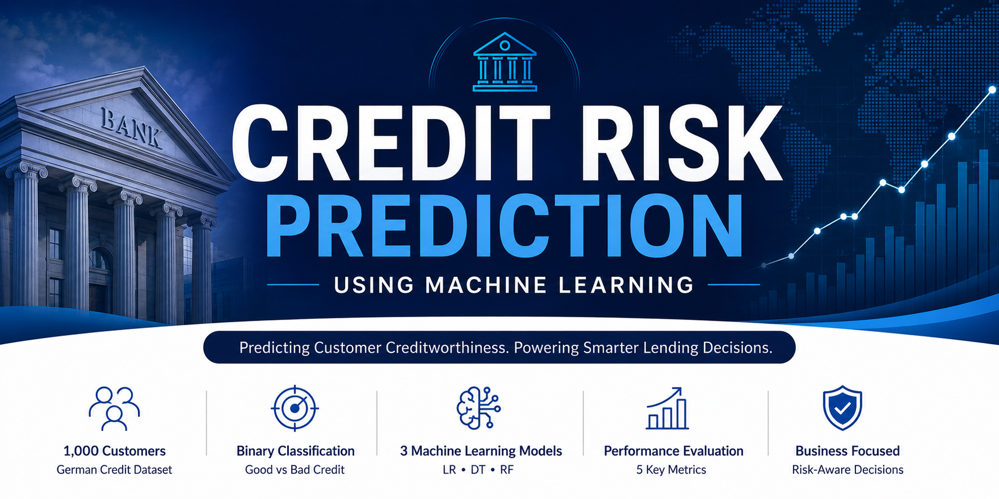

# 🏦 Credit Risk Prediction Using Machine Learning

<p align="center">
  
</p>

> **An end-to-end machine-learning project for credit-risk assessment using the German Credit Dataset, with structured preprocessing, model comparison, and business-focused evaluation.**

**Status:** Complete ML case study · **Deployment:** Not currently deployed · **API:** None  
See [PROJECT_STATUS.md](PROJECT_STATUS.md) for what works, deployment guidance, limitations, and next steps.

<p align="center">


</p>

<p align="center">


</p>

---

# 📑 Table of Contents

- [📌 Project Overview](#-project-overview)
- [💼 Business Problem](#-business-problem)
- [🎯 Project Objectives](#-project-objectives)
- [📊 Dataset Overview](#-dataset-overview)
- [🏗️ Project Architecture](#️-project-architecture)

---

# 📌 Project Overview

Financial institutions rely on accurate credit risk assessment to determine whether a loan applicant is likely to repay borrowed funds. Incorrect lending decisions expose banks to loan defaults, increased operational costs, and reduced profitability, while unnecessarily rejecting creditworthy customers results in lost business opportunities.

This project presents an end-to-end Machine Learning solution for predicting customer credit risk using the **German Credit Dataset**. Three supervised learning algorithms—**Logistic Regression**, **Decision Tree**, and **Random Forest**—were developed and evaluated to determine the most suitable model for supporting lending decisions.

The project follows a complete machine learning workflow beginning with data understanding and exploratory data analysis, progressing through data preprocessing and model development, and concluding with model comparison and business recommendations.

Rather than selecting a model based solely on accuracy, this project evaluates each algorithm using multiple classification metrics, including **Accuracy**, **Precision**, **Recall**, **F1-Score**, and **ROC-AUC**, ensuring that the final recommendation reflects both technical performance and business impact.

---

# 💼 Business Problem

Banks face a constant challenge when evaluating loan applications.

Approving loans for high-risk applicants may lead to loan defaults, financial losses, and increased recovery costs. On the other hand, rejecting customers who are capable of repaying their loans reduces customer acquisition, limits revenue growth, and weakens long-term business performance.

Traditional rule-based credit assessment methods may struggle to capture complex relationships between customer characteristics and repayment behaviour. Machine Learning provides an opportunity to improve these decisions by learning patterns from historical customer data and supporting more consistent, objective, and scalable credit risk assessment.

This project investigates whether supervised machine learning models can effectively distinguish between **Good** and **Bad** credit applicants while balancing financial risk with profitable lending decisions.

---

# 🎯 Project Objectives

The primary objectives of this project are to:

- Develop an end-to-end machine learning pipeline for credit risk prediction.
- Explore and understand customer credit data through Exploratory Data Analysis (EDA).
- Clean and preprocess the dataset for machine learning.
- Handle missing values and encode categorical variables appropriately.
- Compare multiple classification algorithms using consistent evaluation metrics.
- Identify the most suitable baseline model for credit risk prediction.
- Translate technical findings into practical business recommendations for financial institutions.

---

# 📊 Dataset Overview

**Dataset:** German Credit Dataset

The dataset contains demographic, financial, employment, and loan-related information for **1,000 loan applicants**. Each record represents an individual customer together with a binary target variable indicating whether the customer represents a **Good** or **Bad** credit risk.

### Key Features

| Category | Features |
|----------|----------|
| Customer Information | Age, Sex |
| Employment | Job |
| Financial Status | Saving Accounts, Checking Account |
| Loan Information | Credit Amount, Duration, Purpose |
| Housing | Housing Status |
| Target Variable | Risk (Good / Bad Credit) |

### Target Variable

| Value | Meaning |
|-------|---------|
| **0** | Good Credit |
| **1** | Bad Credit |

The dataset presents a moderately imbalanced classification problem, making it necessary to evaluate models using metrics beyond overall accuracy.

---

# 🏗️ Project Architecture

```text
Credit_Risk_Project/
│
├── data/
│   ├── raw/
│   └── processed/
│
├── notebooks/
│   ├── 01_data_understanding_eda.ipynb
│   ├── 02_data_cleaning_preprocessing.ipynb
│   └── 03_model_building_evaluation.ipynb
│
├── reports/
│   └── findings.md
│
├── requirements.txt
├── README.md
└── .gitignore
```

### Repository Organization

| Folder | Description |
|---------|-------------|
| **data/** | Contains the raw dataset and processed datasets used during model development. |
| **notebooks/** | Jupyter notebooks covering the complete machine learning workflow from EDA to model evaluation. |
| **reports/** | Project documentation, findings, and business recommendations. |
| **requirements.txt** | Python dependencies required to reproduce the project. |
| **README.md** | Project documentation and usage guide. |

---

> **Next:** Part 2 covers the complete machine learning workflow, exploratory data analysis, preprocessing pipeline, models developed, evaluation metrics, and model comparison.

---

# ⚙️ Machine Learning Workflow

The project follows a structured end-to-end machine learning pipeline designed to transform raw customer data into actionable business insights.

```text
                     🏦 German Credit Dataset
                              │
                              ▼
                  📊 Data Understanding
                              │
                              ▼
               📈 Exploratory Data Analysis
                              │
                              ▼
                 🧹 Data Preprocessing
                              │
     ┌──────────────┬──────────────┬──────────────┐
     ▼              ▼              ▼
🤖 Logistic     🌳 Decision      🌲 Random
 Regression         Tree           Forest
     └──────────────┴──────────────┘
                    ▼
          📋 Model Comparison
                    ▼
      💼 Business Recommendation
```

The workflow was intentionally designed to follow industry best practices, ensuring that each stage builds upon the previous one while preventing data leakage and maintaining reproducibility.

---

# 📈 Exploratory Data Analysis (EDA)

Before model development, the dataset was explored to understand customer characteristics, identify potential data quality issues, and uncover relationships that could influence credit risk.

Key findings from the analysis include:

- The dataset contains a higher proportion of **Good** credit customers than **Bad** credit customers, resulting in a moderately imbalanced classification problem.
- Credit Amount and Loan Duration exhibited right-skewed distributions with several realistic high-value observations.
- Loan Duration appeared to have a stronger relationship with credit risk than Age and Credit Amount.
- Categorical variables such as Checking Account, Saving Accounts, Housing, Job, and Purpose demonstrated varying relationships with customer creditworthiness.
- Correlation analysis showed no severe multicollinearity among numerical variables, allowing all major numerical features to remain in the modelling process.

These findings guided the preprocessing decisions and feature selection strategy used throughout the project.

---

# 🧹 Data Preprocessing Pipeline

Raw data rarely satisfies the requirements of machine learning algorithms. Therefore, several preprocessing techniques were applied to improve data quality and prepare the dataset for modelling.

The preprocessing pipeline included:

✅ Removing unnecessary identifier columns

✅ Handling missing values by introducing an **Unknown** category instead of deleting customer records

✅ Binary Encoding for binary categorical variables

✅ Ordinal Encoding for ordered categorical variables

✅ One-Hot Encoding for nominal categorical variables

✅ Feature Scaling using **StandardScaler**

✅ Stratified Train-Test Split (80% Training / 20% Testing)

✅ Saving processed datasets for reproducibility

These preprocessing steps ensured that all models were trained using clean, consistent, and leakage-free data.

---

# 🤖 Machine Learning Models

Three supervised classification algorithms were developed and evaluated.

## 1️⃣ Logistic Regression

Logistic Regression served as the baseline model because of its simplicity, interpretability, and suitability for binary classification problems.

### Strengths

- Fast training
- Easy to interpret
- Computationally efficient
- Strong baseline model

### Limitations

- Assumes linear relationships
- Struggled to detect high-risk borrowers

---

## 2️⃣ Decision Tree

The Decision Tree classifier learns nonlinear decision rules by repeatedly splitting the data according to feature values.

### Strengths

- Easy to explain
- Captures nonlinear relationships
- Higher recall for risky borrowers

### Limitations

- Prone to overfitting
- Lower precision than Logistic Regression

---

## 3️⃣ Random Forest

Random Forest combines multiple Decision Trees using ensemble learning to improve predictive performance and reduce overfitting.

### Strengths

- Strong generalization
- Highest overall performance
- Reduced model variance
- Better balance between Precision and Recall

### Limitations

- Longer training time
- Reduced interpretability compared to Logistic Regression

---

# 📊 Model Performance

The three classification models were evaluated using multiple performance metrics to ensure a balanced assessment of predictive capability.

| Model | Accuracy | Precision | Recall | F1-Score | ROC-AUC |
|:------|---------:|----------:|--------:|---------:|--------:|
| Logistic Regression | 73.0% | 62.5% | 25.0% | 35.7% | 67.2% |
| Decision Tree | 70.0% | 50.0% | **50.0%** | 50.0% | 64.3% |
| **🏆 Random Forest** | **76.5%** | **68.6%** | 40.0% | **50.5%** | **74.7%** |

---

# 🏆 Model Comparison

Each model demonstrated unique strengths and weaknesses.

| Model | Strengths | Weaknesses |
|--------|-----------|------------|
| **Logistic Regression** | Simple, interpretable, computationally efficient | Low Recall for risky borrowers |
| **Decision Tree** | Highest Recall, captures nonlinear relationships | Overfitting and lower Precision |
| **Random Forest** | Highest Accuracy, Precision, F1-Score and ROC-AUC | Slightly lower Recall than Decision Tree and reduced interpretability |

The Random Forest model achieved the strongest overall balance between predictive performance and business value, making it the recommended baseline model for this project.

---

# 📌 Key Takeaways

- No single evaluation metric is sufficient for credit risk prediction.
- Accuracy alone can be misleading when dealing with imbalanced datasets.
- Recall is critical because missing risky borrowers may lead to loan defaults.
- Precision helps minimize the rejection of creditworthy applicants.
- Random Forest achieved the best overall balance across multiple evaluation metrics.
- Model selection should always consider both technical performance and business impact rather than relying on a single metric.

---

# 💼 Business Recommendations

Based on the experimental results, the **Random Forest Classifier** is recommended as the preferred baseline model for credit risk prediction. It achieved the strongest overall balance between predictive accuracy, precision, F1-Score, and ROC-AUC while maintaining improved detection of high-risk borrowers compared to Logistic Regression.

Although Random Forest outperformed the other evaluated models, it should be viewed as a **baseline model** rather than a production-ready solution. Further optimization is recommended before deployment in a real banking environment.

---

# 🧠 Skills Demonstrated

This project demonstrates practical experience in:

- Exploratory Data Analysis (EDA)
- Data Cleaning & Preprocessing
- Missing Value Handling
- Feature Encoding & Scaling
- Machine Learning Classification
- Model Evaluation & Comparison
- Business Interpretation of Machine Learning Results
- Credit Risk Analytics
- Git & GitHub
- Technical Documentation

---

# 🚀 Installation & Usage

Clone the repository:

```bash
git clone https://github.com/jairus011/credit-risk-prediction.git
```

Navigate to the project directory:

```bash
cd credit-risk-prediction
```

Install the required dependencies:

```bash
pip install -r requirements.txt
```

Launch Jupyter Notebook:

```bash
jupyter notebook
```

Run the notebooks sequentially:

1. Data Understanding & EDA
2. Data Cleaning & Preprocessing
3. Model Building & Evaluation

---

# 🔮 Future Roadmap

Planned improvements for future versions include:

- Hyperparameter tuning using GridSearchCV
- Addressing class imbalance with SMOTE or class weighting
- Probability threshold optimization
- Advanced ensemble models (XGBoost, LightGBM, CatBoost)
- Model explainability using SHAP
- Deployment as a REST API using FastAPI or Flask

---

# 👨‍💻 Author

**Jairus Omondi**

BSc Data Science & Analytics

**Areas of Interest**

- Machine Learning
- Credit Risk Analytics
- Fraud Detection
- Risk Analytics
- Artificial Intelligence

GitHub: https://github.com/jairus011

---

## ⭐ Final Remarks

This project represents my second end-to-end machine learning case study and demonstrates the complete lifecycle of a predictive analytics project—from understanding raw data to delivering business-driven recommendations.

Beyond building predictive models, this project reinforced the importance of combining technical evaluation with business reasoning when solving real-world financial problems. It forms part of my growing portfolio in **Machine Learning, Credit Risk Analytics, and AI-driven decision support systems**.